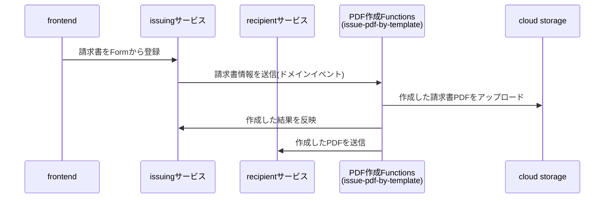

 # issue-invoice-pdf

## イベントフロー



## ローカルで動作確認
Functionsを起動
```
npm install
npm run dev
```

### サンプルのリクエストを送信
curlでリクエストを送って`2024-summer-invoice.pdf`が作成されることを確認する
test/fixtures/sample-local-request.jsonの内容がリクエストされる。
(storageアップロードとイベント発行は動作確認時にはコメントアウトしている)
```
curl -X POST localhost:8400 -H "Content-Type:application/json" -d @test/fixtures/sample-local-request.json
```


##